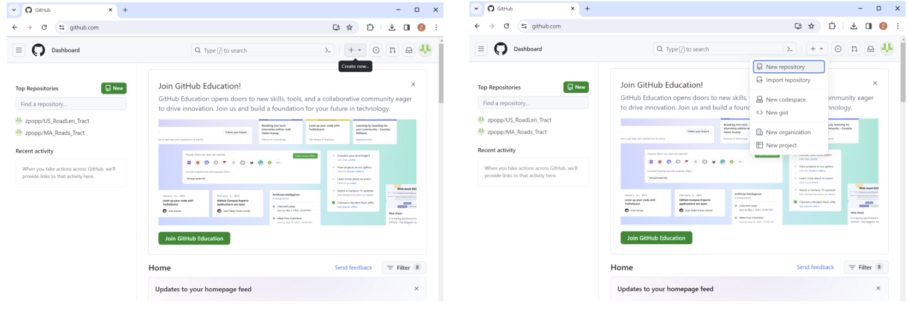
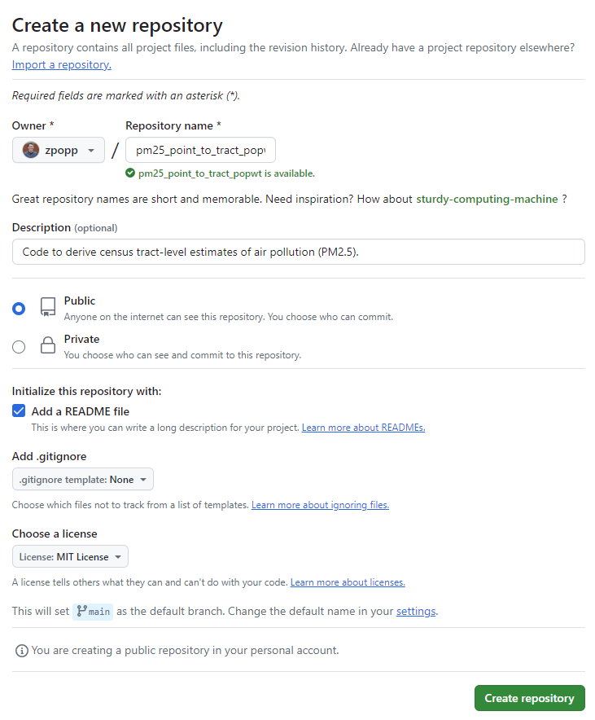
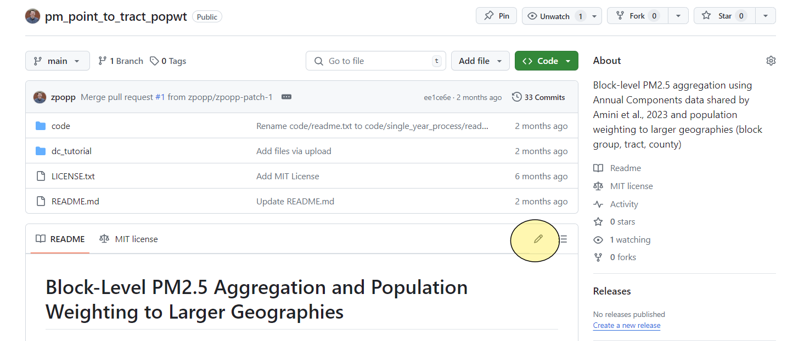
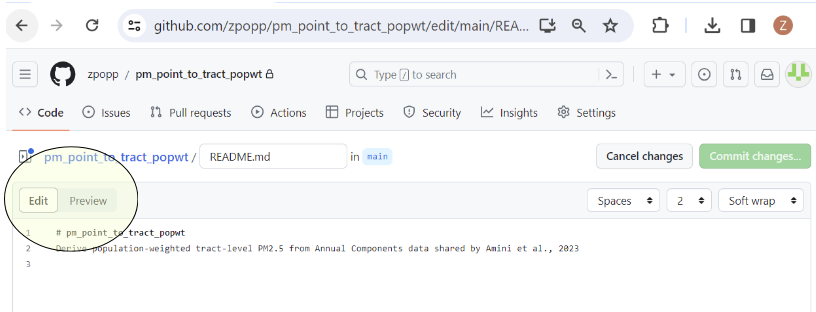
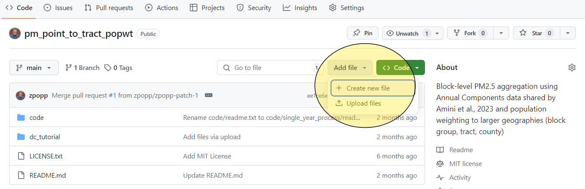
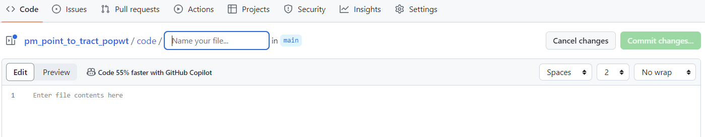
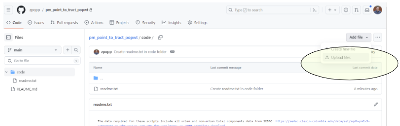
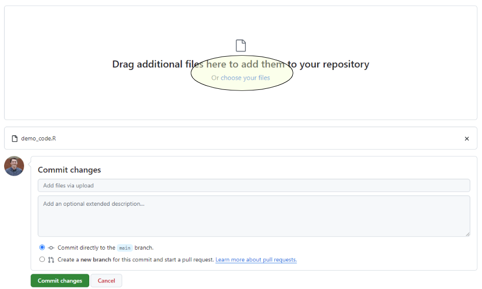
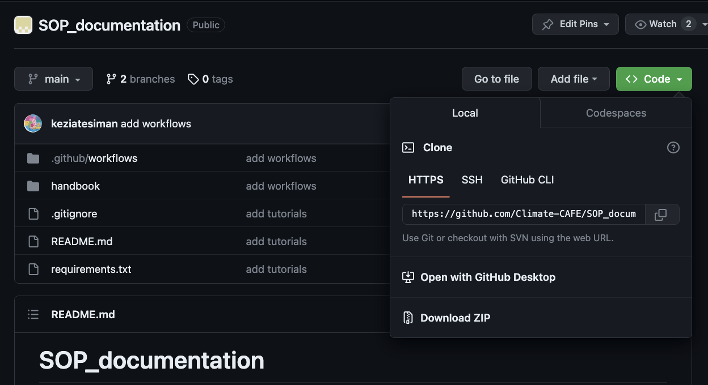
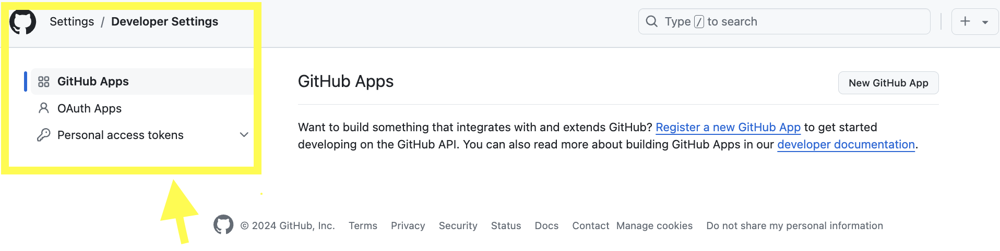

# Getting Started with GitHub

GitHub is a user-friendly platform that allows you to easily share your code with others, which is becoming a typical requirement for research publications. Even if you're not interested in the technical aspects of code development, GitHub provides a straightforward way to create repositories where you can store your research scripts. This tutorial will guide you through the basics of setting up a repository on GitHub, uploading your files, and sharing your work with collaborators or the public. 

Following the [Basic GitHub Introduction](basic-github-introduction) section below, you will be able to upload your code without needing to install any software on your machine or use the command line. For those interested in using the command line interface, refer to the [Cloning Repositories and Pushing Code](cloning-repositories-and-pushing-code) section for basic Git commands.

## Table of Contents

**Basic GitHub Introduction**

1. [Sign In or Create an Account](#1-sign-in-or-create-an-account)
2. [Create a New Repository](#2-create-a-new-repository)
3. [Create a README](#3-create-a-readme)
4. [Commit Changes](#4-commit-changes)
5. [Add Your Code](5-#add-your-code)

**Cloning Repositories and Pushing Code**
1. [Cloning a Repository](#1-cloning-a-repository)
2. [Pushing Code to a Repository](2-pushing-code-to-a-repository)

------

## Basic GitHub Introduction
### 1. Sign In or Create an Account

If you don’t have a GitHub account, go to GitHub’s website and sign up. If you already have an account, sign in.

Once you have an account, you can set up your first repository, or repo. Each of your repositories will represent all of the code and data that you want to share relevant to a given data processing project.

### 2. Create a New Repository

#### Create a New Repository

Create a new repository by selecting the “Create new” or + icon on the landing page for your account. Select “New repository” from the dropdown that appears after clicking on the + icon.



#### Fill in Repository Details
You will see a menu of options when you create your repository. The repository will be linked to your account, so you will see your username followed by a back slash where you will name your repository.
1. Write the **Repository** name that you want to have for your repository after this slash. The name should be short and sufficiently descriptive for a user to understand the purpose of the repository. 
2. You can add additional details about your project in the **Description** section.
3. For others to be able to see your code, you will set the repository to be public. While you get familiar with GitHub and add your code and data, you may want to start by creating a private repository. This can be changed later.
4. Select the option to Add a README file, as this is where you will provide a description of your script and files. 
5. You can also select to add a .gitignore template. One of the common ways that GitHub is used is by “cloning” a repository. This process replicates all of the files within the repository on GitHub to the computer of the person who “cloned” the repository. The purpose of the .gitignore file is to flag some files that might not need to be downloaded when cloning. 
6. You can also choose a license here, which will place a text file describing how your code can be used within the repository. An example of a license can be found here: [MIT License](https://opensource.org/license/mit). You can also refer to your institutional guidelines for further information on appropriate licensing. 
7. Once you have completed the required fields, you can hit “Create repository” to move forward towards the next steps in sharing your code.



**Please note**: The goal of GitHub is to be transparent about the code development process. Because of this, all of the changes that you make, even while your repository is private, will be visible after you switch the repository to public when you are ready to share. This means that any private information that might be present in code or data (e.g.: passwords, PII), should be *removed before being added to GitHub*. 

#### 3: Create a README

You have officially created your first repository! The only file currently within the repository will be the README template (if you selected this option in creating the repository). The README will initially include only the title and description that you had set. A good README should contain a clear description of the purpose of your code and data. Examples of information to include can be found on the [Reproducible Data Creation Pipeline](https://climate-cafe.github.io/template.html) page.

To edit your README, you can select the pencil icon. 



After selecting the pencil icon, you will see a screen with two tabs. One tab will read **Edit**. This tab shows the README Markdown code used to generate the text that you see in your repo’s README. For more information about Markdown, guidance can be found here: [Markdown Guide](https://www.markdownguide.org/basic-syntax/). To see the product of the Markdown code, you can shift to the **Preview** section. 



#### 4: Commit Changes

As you write the relevant sections of your README, you will see the Commit changes… button in the upper right change to a darker green. Committing changes is how you save your progress in GitHub. Each “commit” is essentially a save of your work and an update to the content.

Once you have written out your README text and selected the Commit changes… button, you will see a pop-up where you can enter your commit message. Commit messages are a useful tool for tracking progress and letting yourself and any collaborators know what changes you have made since the last save. For this commit message, you might just say that you have written out the README.


**Please** note that like all of the files which you will share, the commit changes and messages will be visible to the public after your repository becomes public.

After you have written your commit message, you have two options to select from before saving your progress with the **Commit changes** button. The default option will be to commit directly to the main branch. This means you want to immediately update your project. Creating a new branch and starting a pull request is what you do if you want to suggest changes to someone else’s repository, or if you want to continue to make a series of different changes in a new space without updating your main project area each time.

If you select “**Commit directly to the main branch**”, your README changes will be saved immediately on your main repository. You can continue to make and commit changes as needed.

#### 5: Add Your Code 

Once your README is complete, the next step will be to submit your scripts to GitHub. To start that process, you can return to your repository landing page by selecting the link to your repository name.

It is best practice to save any code or data you are sharing through GitHub in a folder infrastructure that will be interpretable to new users. Before uploading your code, you can create a code folder with an additional README describing the files to be uploaded there. To do this, you can select the “**Add file**” button, and then select “**+Create new file**”



Selecting the “**+Create new file**” button will open Markdown text like when you were creating your README. To add a folder to your repository, you can type the name you would like for the folder, and then add a back slash after. Here, we have created a folder for /code/. You will not be able to save your folder unless you create a file within “code”. You can type a short description of the files you would like to upload in the Markdown text area, and then repeat the process above to commit changes to the main branch in your repository.



After you have committed your changes, you will see the contents of the folder that you have just created, along with the text file that you had added to it. The next step will be to upload your scripts. To do this, select the “**Add file**” button from within your code folder, and then select “**Upload files**”.



You will see a screen where you can either select files to upload from a folder or drag and drop your code. Once your files have been uploaded, you can select “**Commit changes…**” again to save the changes.



Returning to the repository home page, you will be able to see your README file and your code folder, the main components that will allow other researchers to replicate your work. As you have any further changes, you can commit changes and have a record of past versions.

## Cloning Repositories and Pushing Code
## 1. Cloning a Repository

#### Find a Repository to Clone

Make sure you have `git` installed.

#### Get the Repository URL

1. Open a Github repository url in your browser. You can clone both your own repositories or those shared by others.
2. Click the "Code" button.



3. Copy the repository URL.

#### Clone the Repository Locally

Open your terminal or command prompt and navigate to the directory where you want to clone the repository.

```bash
cd /path/to/your/directory
```

Once you have `git` installed, use the `git clone` command followed by the repository URL you copied:

```bash
git clone https://github.com/username/repository-name.git
```

Replace `https://github.com/username/repository-name.git` with the actual repository URL.

#### Access the Cloned Repository

You now have a local copy of the repository on your computer.

---

### 2. Pushing Code to a Repository

#### Make Changes

Make changes to the files in your local repository using your preferred code editor or IDE.

#### Stage and Commit Changes

1. Stage the changes by using the `git add` command:

```bash
git add .
```

This stages all the changes in your local repository.

2. Commit the changes with a descriptive message:

```bash
git commit -m "Your commit message here"
```

Replace `"Your commit message here"` with a brief, informative message about the changes you made.

#### Push Changes to GitHub

Use the `git push` command to send your committed changes to GitHub:

```bash
git push origin main
```

Replace `main` with the name of the branch you're working on, e.g., `master` or `develop`.

#### Verify Changes on GitHub

Visit your GitHub repository in a web browser to see your changes reflected in the repository.

#### Obtaining GitHub token

You can follow the following steps, to obtain a GitHub token:

1. Log in to your GitHub account and go to your “Settings” page.
2. Click on “Developer settings” in the left-hand sidebar.
3. Click on “Personal access tokens” and choose “Tokens (classic)”.



4. Click on “Generate new token” then “Generate new token (classic)” .
5. Give your token a description, so you can remember what it is for.
6. Select all the scopes available.
7. Click on “Generate token”.


```{note}
Your new token will be displayed. Be sure to copy it and save it for future use, as you won’t be able to see it again.
```

Once you have generated a token, you can use it to authenticate with the GitHub API or access repositories that require authentication. Keep your token secret and avoid sharing it with others to protect your GitHub account’s security.

