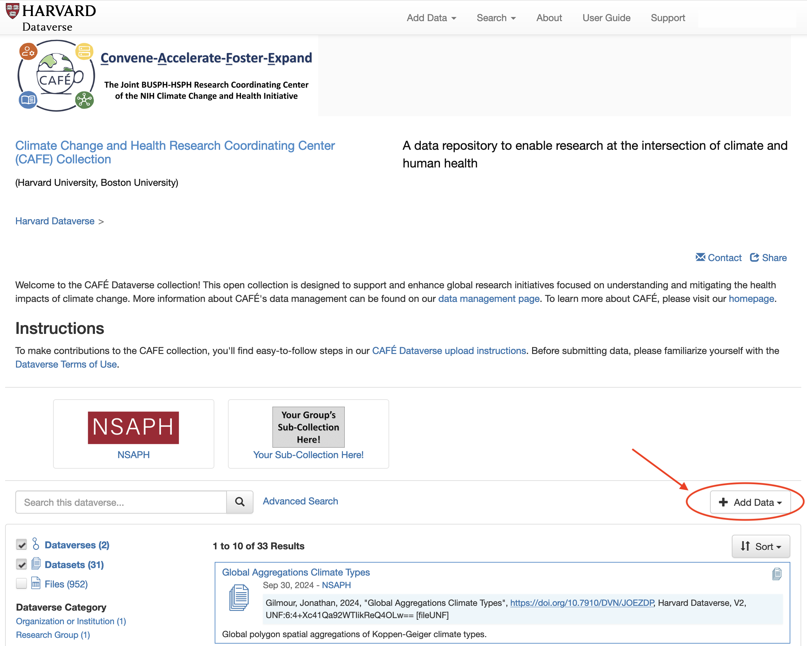
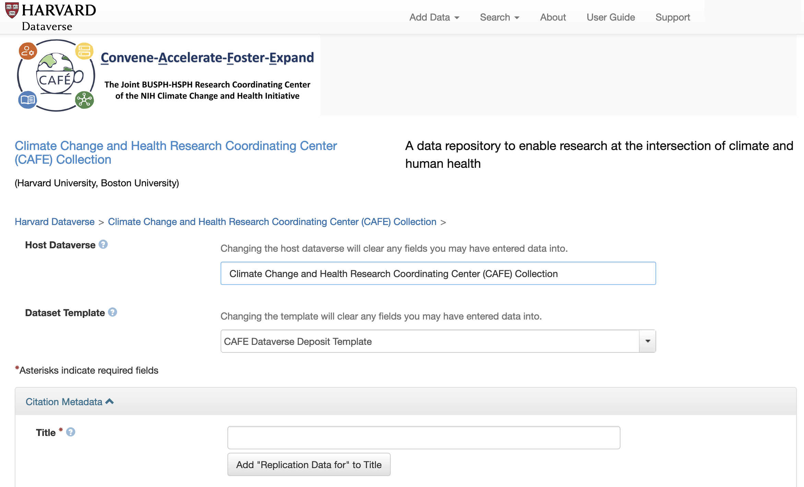

# Contributing to the Climate-Health CAFÉ Dataverse Collection

## Guidelines for Dataset Contributions

We strongly encourage the community of practice to contribute to the expansion of the CAFE Dataverse Collection. Emphasizing open access and collaborative research, the CAFE Collection invites contributions from a diverse array of stakeholders, including government agencies, NGOs, community-based organizations, industry partners, and academics. 

Parameters for what datasets are appropriate and inappropriate for the CAFE Collection are described below:

## General Guidance

- Contributions should be relevant to climate and health research.
- The submission of processed derivatives or expansions of data accessible through existing sharing resources (ie: SEDAC, Google Earth Engine) are encouraged.
- Contributions should be in line with the licensing of raw source data.
- Data contributors should only post data that they own, have generated, or have been granted permission to reshare in a manipulated version (ie: census data).
- If you are uploading raw source data that can be reposted for easier accessibility to the climate and health community, please note this in the Title and Description
- No restricted access data (ie: data including personal identifying information) should be shared through the CAFE Collection. Contributions will be widely accessible to Harvard Dataverse users.

## File Formatting and Size Limitations
- All file types are supported for upload and download
- A maximum of 1,000 files are allowed per upload
- The file upload limit is 300 GB per file
- Dataverse can ingest data in certain formats as specifically as tabular data, which will allow for exploration and manipulation of the data with external tools. Tabular file ingest is limited to 143.1MB. For more information, see: Dataverse [Tabular Data File Guide](https://guides.dataverse.org/en/6.1/user/dataset-management.html#tabular-data-files) 

## Adding to a Sub-Collection
The CAFE Collection provides infrastructure for organizing entries called sub-collections. A sub-collection is a great way to keep your lab or organization's uploaded datasets together in one place while still being a part of the CAFE Collection. For an example, see the [NSAPH sub-collection](https://dataverse.harvard.edu/dataverse/nsaph).

If you would like to have a sub-collection within the CAFE Collection, please submit the [Request Form for CAFÉ Sub-Collection](https://docs.google.com/forms/d/e/1FAIpQLScxyjsfirC_b4WhSweODlk5AVZJGxQklN7oxNtn_j4lybldHA/viewform) with details of your project, department, organization, or publication. Please note that subcollections are meant to organize data from specific contributors and teams, not based on topics and themes. Data users can find data under specific themes and research topics by using the search functions, so long as your contribution has included the relevant keywords, controlled vocabulary, and other relevant metadata. The next section describes these metadata in more depth.

# Harvard Dataverse Repository Tutorial
This tutorial provides step-by-step instructions on how to upload data to the [**Climate Change and Health Research Coordinating Center (CAFE) Collection**](https://dataverse.harvard.edu/dataverse.xhtml?alias=CAFE) within the Harvard Dataverse Repository. 

Click below to view a tutorial video on uploading to the Harvard Dataverse CAFE Collection.

## Prerequisites

Before you begin, ensure you have the necessary data files, github links, and information ready for upload.

## Steps

1. **Log In or Create an Account**

   - If you haven't already, visit the [**Climate Change and Health Research Coordinating Center (CAFE) Collection**](https://dataverse.harvard.edu/dataverse.xhtml?alias=CAFE) and either log in to your existing account or create a new one.

2. **Select "Add Data" from the CAFE Dataverse Collection page**

   - You will add your contribution starting from the CAFE Collection page on Dataverse.
   - From the main Dataverse landing page, you can find the CAFE Collection by using the Search function at the top of the page.
   - Once you have arrived to the CAFE Collection, find the "Add Data" button by scrolling down the page. You will find "Add Data" right above the list of all datasets in the Collection. Note that there is an "Add Data" button at the top that will not automatically deposit your data to the CAFE Collection.

   - Select "Add Data" and then "New Dataset" to start your contribution.
   - Before filling out the required metadata, confirm that you are contributing to the CAFE Collection by ensuring the Host Dataverse is "Climate Change and Health Research Coordinating Center (CAFE) Collection" and the Dataset Template is "CAFE Dataverse Deposit Template"
  

3. **Fill in Dataset Information**
Please follow the prompts provided in the Metadata checklist to provide the descriptors required to make your dataset available through Dataverse. Some context-specific instructions have been added to the upload form, and you can additionally find field-specific explanations for each field by hovering your cursor over the question-mark icon next to the entry.
For additional clarity, we have highlighted directions for a few key fields that may be unfamiliar to users:
   -   **Keywords and Controlled Vocabulary**: Add keywords to aid in discoverability. Controlled vocabulary is used to ensure keywords are consistent across different data contributors. NIEHS has established a glossary of keywords that CAFE data contributors are expected to use. Select keywords relevant to your data from the [Climate Change and Human Health Glossary](https://tools.niehs.nih.gov/cchhglossary/). The Controlled Vocabulary Name can be left blank in the metadata, but the glossary link should be included in the URL section. This URL should appear as a default. If you would like to include keywords from another glossary, follow the same procedure using the + button to add new keywords and including the relevant URL for each.
   -   **Geospatial Metadata**. Provide information about the area(s) that your data covers as directed by the checklist prompts.
   -   **Computational Workflow**: Open source processing is a priority for reproducibility. Refer to the [Code Sharing Walkthrough page](https://climate-cafe.github.io/code_sharing_workflow.html) for details on the expectations for processing pipelines. Include a link to your processing pipeline (ie:GitHub) if applicable.
   -   **Metadata About Data Sources**: Include all available information about any raw data source from which the dataset was derived (Select *Yes* from the Derived from Another Dataset option before completing this section).
   -   **Metadata About Geospatial Files**: These details are relevant strictly for spatial file formats. 

4. **Upload Data Files**

   - The last component of the dataset submission involves uploading your data and code (if not using online computational workflow). You can select or upload files, specify their naming, and specify a folder infrastructure if needed. 
   - Click the "Select Files to Add" button to choose files from your local device or drag and drop files into the upload widget. In addition to the metadata specified in this form, a .csv data dictionary describing all variables should be uploaded as a file with your submission.
   - **Note:** Dataverse supports a wide range of file types. Ensure your files are within the specified size limits.

6. **Finalize and Edit Metadata**

   - Select *Save Dataset* when all fields are filled and you have added the files you would like to submit. After you have saved your dataset, you can edit the metadata to add additional information by selecting *Edit Dataset*
     
7. **Submit**

   - Once you're satisfied with the dataset and metadata, click the "*Submit for Review*" button.

Congratulations! You've successfully uploaded your data to the Harvard Dataverse Repository under the "**Climate Change and Health Research Coordinating Center (CAFE) Collection**" organization. Your dataset is now being reviewed for collaboration, sharing, and archiving within the CAFE Collection.
